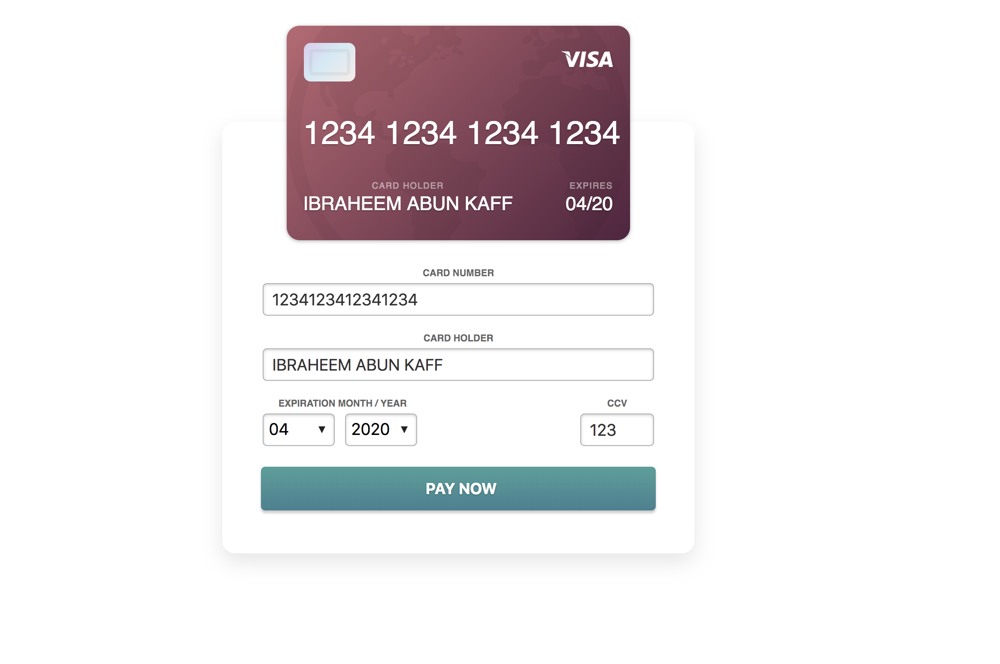
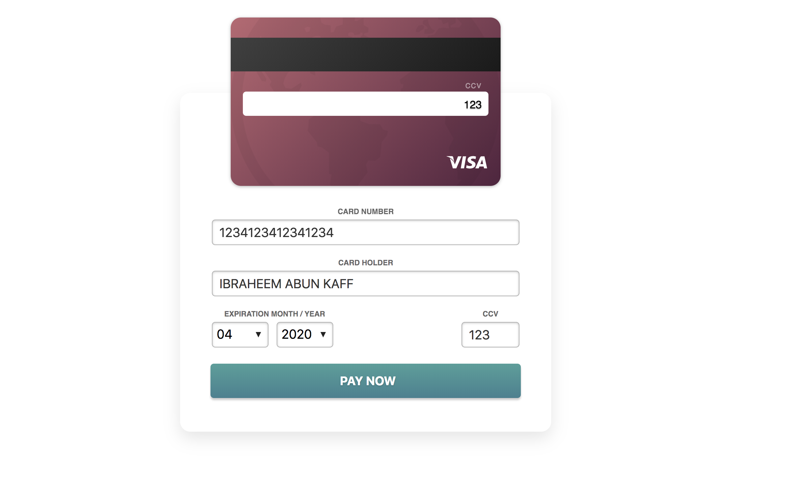

# react-fancy-visa-card
React js implementation for visa credit card  -  Payment Form

<h2>How to install ?</h2> 
<pre>
yarn add react-fancy-visa-card
</pre>


<br />
<br />

<h2>Examples:</h2>




<br />
<br />

<h1>How to use it ? </h1>

```
import React, {Component} from "react";
import {VisaCreditCard as VisaCard} from "react-fancy-visa-card";


class App extends Component {

    pay = (e, data) => {
        console.log(data);

    };

    render() {
        return (
            <div className="App">
            
                <VisaCard onSubmit={this.pay} />

            </div>
        );
    }
}

export default App;
```

<h1>Available options to pass :</h1>


```
<VisaCard onSubmit={this.pay} 
 
 frontCardColor="red"
 backCardColor="black"
 submitBtnColor="white"
 submitBtnTxt="Pay $350"
 
 
 />

```


```
<VisaCard frontCardColor="linear-gradient(50deg, #f3c680, hsla(179,54%,76%,1))" />

```


